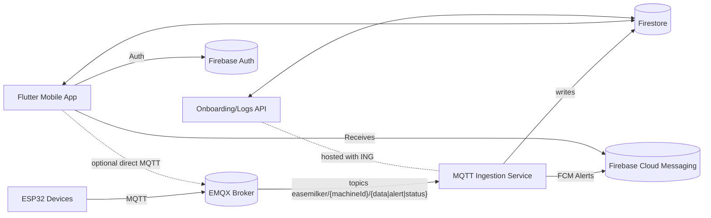

# EaseMilker Backend — Firebase + EMQX + MQTT Ingestion

Step-by-Step Setup (Windows PowerShell)

1) Prerequisites
- Install Node.js LTS and npm from nodejs.org
- Optional (for deployment later): Install Google Cloud SDK and sign in: `gcloud init`

2) Create Firebase project and service account (one-time)
- Go to https://console.firebase.google.com → Add project → note the `projectId`.
- In Google Cloud Console → IAM & Admin → Service Accounts → Create Service Account:
  - Role: Firestore User, Firebase Admin (or Editor for quick start)
  - Create key → JSON. Save to `d:\EaseMilker-App\service-accounts\firebase-admin.json`.

3) Enable Firestore and (optional now) FCM
- Firebase Console → Build → Firestore Database → Create Database (Native mode).
- (Optional for alerts) Firebase Console → Cloud Messaging → set up app later.

4) Apply Firestore rules
- Firebase Console → Firestore → Rules → Replace with contents of `firebase.rules` from this repo → Publish.

5) Configure MQTT and backend env
- Quick local test (insecure, dev-only): use public broker
  - `MQTT_BROKER_URL = mqtt://broker.emqx.io:1883`
- Production (recommended): EMQX Cloud or your broker with TLS
  - `MQTT_BROKER_URL = mqtts://<your-host>:8883` and set username/password
- Create local env file and install deps:
```powershell
cd d:\EaseMilker-App\functions
copy .env.sample .env
notepad .env
npm install
```
- Edit `.env` with your values. Minimal example (dev):
```
FIREBASE_PROJECT_ID=your-project-id
GOOGLE_APPLICATION_CREDENTIALS=../service-accounts/firebase-admin.json
MQTT_BROKER_URL=mqtt://broker.emqx.io:1883
MQTT_USERNAME=
MQTT_PASSWORD=
MQTT_CLIENT_ID=easemilker-ingestor-local
PORT=8080
LOG_LEVEL=info
```

6) Run the backend locally
```powershell
cd d:\EaseMilker-App\functions
$env:GOOGLE_APPLICATION_CREDENTIALS="d:\EaseMilker-App\service-accounts\firebase-admin.json"
npm run dev
```
- Expected: logs like “API server started” and “MQTT connected” (once a valid broker is set).

7) Verify end-to-end (Acceptance test)
Open a new PowerShell window (keep backend running), then:
```powershell
cd d:\EaseMilker-App\tests
$env:FIREBASE_PROJECT_ID="your-project-id"
$env:MQTT_BROKER_URL="mqtt://broker.emqx.io:1883"  # or your TLS URL
node publish_and_verify.js
```
- Expected: `Success: Firestore entry created`. Check Firestore → `machines/TEST_MACHINE_001/logs/<YYYY-MM-DD>/entries/<ts>`.

8) Optional — Deploy to Cloud Run (production)
- Ensure gcloud is set to your project:
```powershell
$env:GOOGLE_CLOUD_PROJECT="your-project-id"
$env:MQTT_BROKER_URL="mqtts://your-emqx-host:8883"
$env:MQTT_USERNAME="your-user"
$env:MQTT_PASSWORD="your-pass"
$env:MQTT_CLIENT_ID="easemilker-ingestor"
$env:MQTT_TLS="true"
wsl bash infra/deploy.sh
```
- Cloud Scheduler (daily): Create a job to POST `https://<cloud-run-url>/internal/aggregate/daily` with OIDC auth as your service account.

Tip: The full design, APIs, schema, and troubleshooting remain below for reference.

---

This document is the single source of truth to set up, deploy, test, and operate the EaseMilker backend.

---

## Phase A — Repository Analysis

- Top-level files and folders
  - `analysis_options.yaml`: Dart analyzer and lints for Flutter.
  - `pubspec.yaml`: Flutter app manifest; only `shared_preferences` dependency present.
  - `README.md`: Frontend readme (not backend).
  - `android/`, `ios/`, `linux/`, `macos/`, `web/`, `windows/`: Flutter platform shells.
  - `assets/`: Images for the app.
  - `lib/`: Flutter app source.
    - `main.dart`: App entry; routes and navigation.
    - `login/`: Local auth state with `shared_preferences`; no real backend.
    - `Home page/`, `History page/`, `Settings page/`, `Premium page/`, `Shop page/`, `widgets/`: UI screens; no network/backend code.
  - `build/`: Flutter build outputs (generated, ignore).

- Detected components
  - Frontend: Flutter mobile app (no Firebase, no MQTT, no HTTP). Uses local `shared_preferences` only.
  - Firmware: Not present in this repo.
  - Backend: Not present in this repo.

- Missing backend pieces
  - Authentication: Firebase Auth for the mobile app.
  - Database: Firestore (users, machines, logs, alerts, summaries).
  - MQTT ingestion: Service that subscribes to EMQX topics and writes to Firestore.
  - Push notifications: FCM for alerts (NO_FLOW, LIMIT_REACHED).
  - Device onboarding APIs: Register/unbind machines, fetch machines, fetch logs/aggregates.
  - Scheduled worker: Daily aggregation job for summaries.
  - Security: Firestore rules, broker ACLs, tokens, TLS.

- Risks and insecure/broken patterns
  - Hardcoded credentials: `lib/login/login_page.dart` uses default credentials `_defaultMachineId = 'EM1234'` and `_defaultPassword = 'admin123'` (development-only; must be removed for production).
  - No TLS/networking at all in app: Simulated connectivity (`Home page/home_page.dart`) stores state locally; add real network + secure auth when integrating backend.
  - No secrets yet in repo (good). Keep it that way—use env vars and service accounts.

---

## Phase B — Backend Design and Code

### A. High-level Architecture

- ESP32 devices publish telemetry, status, and alerts to EMQX (MQTT over TLS).
- A Node.js ingestion service (Cloud Run recommended) subscribes to `easemilker/{machineId}/{data|status|alert}`.
- Service writes to Firestore and sends critical alerts via FCM.
- Express APIs provide onboarding (register/unbind) and log retrieval for the app.
- A scheduled job aggregates daily logs into summaries.



Recommendation: Use Cloud Run for the ingestion/API service (long-lived MQTT client, simpler env var management). Cloud Functions 2nd gen also works if using HTTP + a sidecar/scheduler to run ingestion.

### B. MQTT Topics and Conventions

- Base pattern: `easemilker/{machineId}/{channel}`
  - `easemilker/{machineId}/data` (QoS 1, not retained)
    - Payload JSON: `{ "ts": 1731676800000, "volume_ml": 1234, "flow_lpm": 1.2, "temp_c": 36.5, "msgId": "optional-uuid" }`
  - `easemilker/{machineId}/status` (QoS 1, retained)
    - Payload JSON: `{ "ts": 1731676800000, "state": "IDLE|RUNNING|ERROR", "fw": "1.0.0" }`
  - `easemilker/{machineId}/alert` (QoS 1, not retained)
    - Payload JSON: `{ "ts": 1731676800000, "type": "NO_FLOW|LIMIT_REACHED|...", "message": "string" }`
  - `easemilker/{machineId}/command` (QoS 1, not retained)
    - Payload JSON: `{ "ts": 1731676800000, "cmd": "START|STOP|...", "args": { ... } }` (future)

- QoS rationale: Use QoS 1 to ensure delivery without duplicates being harmful (server is idempotent). Retain only `status` so late subscribers get the latest state.

### C. Firestore Schema

Collections:
- `users/{uid}`
  - `displayName`, `email`, `createdAt`.
  - Subcollection `fcmTokens/{tokenId}`: `{ token, platform, updatedAt }`.
- `machines/{machineId}`
  - `ownerId`, `createdAt`, `updatedAt`, `status`, `statusUpdatedAt`, `boundAt`.
  - Subcollection `logs/{YYYY-MM-DD}/entries/{ts}`
    - `{ machineId, ts, data: { volume_ml, flow_lpm, temp_c, ... }, createdAt }`
  - Subcollection `alerts/{YYYY-MM-DD}/entries/{ts}`
    - `{ machineId, ts, type, severity, message, createdAt }`
  - Subcollection `summaries/{period}/entries/{YYYY-MM-DD}`
    - `period` = `weekly` or `monthly`
    - `{ totalVolumeMl, maxTemp, entries, aggregatedAt }`
  - Document `logs/{YYYY-MM-DD}`
    - `{ summary: { totalVolumeMl, maxTemp, entries }, aggregatedAt }`

Example documents:

```json
// users/{uid}
{
  "displayName": "Dhanush Kumar",
  "email": "user@example.com",
  "createdAt": {"_serverTimestamp": true}
}
```

```json
// users/{uid}/fcmTokens/{tokenId}
{
  "token": "fcm-token-string",
  "platform": "android",
  "updatedAt": {"_serverTimestamp": true}
}
```

```json
// machines/{machineId}
{
  "ownerId": "uid123",
  "createdAt": {"_serverTimestamp": true},
  "updatedAt": {"_serverTimestamp": true},
  "status": {"state": "RUNNING", "fw": "1.0.0"},
  "statusUpdatedAt": {"_serverTimestamp": true},
  "boundAt": {"_serverTimestamp": true}
}
```

```json
// machines/{machineId}/logs/{YYYY-MM-DD}/entries/{ts}
{
  "machineId": "EM0214KI",
  "ts": 1731676800000,
  "data": { "volume_ml": 1200, "flow_lpm": 1.1, "temp_c": 36.5 },
  "createdAt": {"_serverTimestamp": true}
}
```

```json
// machines/{machineId}/alerts/{YYYY-MM-DD}/entries/{ts}
{
  "machineId": "EM0214KI",
  "ts": 1731676850000,
  "type": "NO_FLOW",
  "severity": "critical",
  "message": "Flow stopped",
  "createdAt": {"_serverTimestamp": true}
}
```

```json
// machines/{machineId}/logs/{YYYY-MM-DD}
{
  "summary": { "totalVolumeMl": 1200, "maxTemp": 37.0, "entries": 56 },
  "aggregatedAt": {"_serverTimestamp": true}
}
```

### D. Ingestion Service (Node.js) — Cloud Run recommended

- Full code in repo: `functions/index.js`, `functions/package.json`, `functions/.env.sample`.
- Uses env vars for secrets; no hardcoding.
- Subscribes to `easemilker/+/data`, `.../status`, `.../alert`.
- Idempotency: Firestore `create()` with deterministic doc ID (`ts`) prevents duplicates.
- Reconnect/backoff: Exponential backoff on MQTT reconnect.
- Alerts: Sends FCM to owner on `NO_FLOW` or `LIMIT_REACHED`.

### E. Firestore Security Rules

- Located at `firebase.rules` (added to repo). Highlights:
  - Users can access only their own user docs and FCM tokens.
  - Machines readable to owner; client cannot write logs/alerts/summaries (Admin SDK bypasses rules).
  - Owner can bind/unbind by writing `ownerId` on their machine doc.

### F. Device Onboarding & APIs (Express)

- Endpoints (all require Firebase ID token in `Authorization: Bearer <token>`):
  - `POST /api/machines/register` — Body `{ machineId }` → binds machine to user.
  - `POST /api/machines/unbind` — Body `{ machineId }` → removes owner.
  - `GET /api/machines` — Lists current user machines.
  - `GET /api/logs?machineId=...&period=daily|weekly|monthly&date=YYYY-MM-DD` — Fetches summaries/entries.

### G. Daily Summary Worker

- Exposed as `POST /internal/aggregate/daily` (Cloud Scheduler with OIDC can invoke).
- Aggregates yesterday’s logs per machine into `logs/{YYYY-MM-DD}` summary.
- Optionally, add weekly/monthly aggregation into `summaries/{period}/entries/{YYYY-MM-DD}`.

### H. Push Notifications (FCM)

- On alerts `NO_FLOW`, `LIMIT_REACHED`, service fetches tokens from `users/{uid}/fcmTokens/*` and sends multicast notifications.

### I. Deployment & Environment

Recommended: Cloud Run for long-lived MQTT client.

- Required environment variables:
  - `FIREBASE_PROJECT_ID`
  - `MQTT_BROKER_URL` (e.g., `mqtts://broker.emqx.io:8883`)
  - `MQTT_USERNAME`, `MQTT_PASSWORD`
  - `MQTT_CLIENT_ID` (optional)
  - `MQTT_TLS=true`
  - `LOG_LEVEL=info`

- Deploy to Cloud Run (Linux/macOS via bash):

```bash
export GOOGLE_CLOUD_PROJECT=your-project-id
export MQTT_BROKER_URL=mqtts://your-emqx-host:8883
export MQTT_USERNAME=emqx_user
export MQTT_PASSWORD=emqx_pass
export MQTT_CLIENT_ID=easemilker-ingestor
export MQTT_TLS=true

bash infra/deploy.sh
```

- Windows PowerShell equivalent:

```powershell
$env:GOOGLE_CLOUD_PROJECT="your-project-id"
$env:MQTT_BROKER_URL="mqtts://your-emqx-host:8883"
$env:MQTT_USERNAME="emqx_user"
$env:MQTT_PASSWORD="emqx_pass"
$env:MQTT_CLIENT_ID="easemilker-ingestor"
$env:MQTT_TLS="true"

wsl bash infra/deploy.sh
```

- Local run (for testing):

```powershell
cd functions
copy .env.sample .env
npm install
npm run dev
```

- Firebase Admin credentials:
  - For local dev, set `GOOGLE_APPLICATION_CREDENTIALS` to a service account JSON with Firestore+Messaging access.

### J. Monitoring & Logging

- Use Cloud Logging (Stackdriver). Log structured JSON via `pino` (already integrated).
- Key metrics and alerts:
  - High ingestion error rate (>5% per 5 min)
  - MQTT disconnect storms (reconnects > 3/min)
  - Firestore write failures
  - FCM send failures

---

## Testing Checklist

- ESP32 → Broker: Device connects over TLS; publishes to correct topics.
- Ingestion → Firestore: Logs and status appear.
- Alerts → FCM: Push notifications on critical alerts.
- Onboarding APIs: Register/unbind and fetch logs/machines works with ID token.

## Security Checklist

- Enforce TLS on MQTT.
- Broker ACLs scoped to `easemilker/{machineId}/#`.
- Rotate device credentials.
- Deploy `firebase.rules`.
- Restrict Cloud Scheduler → `/internal/*` with OIDC.

## Troubleshooting (Top 10)

1. MQTT TLS/port mismatch → fix URL/port.
2. Bad MQTT creds → rotate/test credentials.
3. No Firestore writes → check ADC/permissions.
4. FCM failure → verify tokens exist.
5. Duplicate data → ensure device timestamps; ingestion is idempotent by `ts`.
6. High reconnect → network/keepalive/broker limits.
7. CORS → configure client origin.
8. 429/quota → enable billing/backoff.
9. Invalid ID token → refresh login in app.
10. Scheduler 401 → configure OIDC service account.

## Files Added

- `functions/index.js`, `functions/package.json`, `functions/.env.sample`
- `firebase.rules`
- `docs/architecture.mmd`
- `infra/deploy.sh`
- `tests/publish_and_verify.js`
- `README_BACKEND.md`

## Acceptance Test

```powershell
cd functions
npm install; npm run dev
cd ..\tests
node publish_and_verify.js
```

## Rollback Plan

- Cloud Run: move traffic to previous revision.
- Re-deploy with previous env vars.
- Re-run aggregation if needed.
